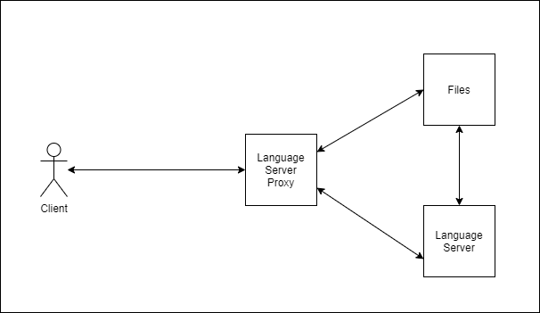

# Architecture

This document describes the high level architecture of the Language Server Proxy, this is the way to easily get up to speed with what the code is doing.

## Birds Eye View

At the highest level, the proxy is simply taking messages from a websocket connection that is initialized with a GET request to the `/ls` endopoint, and sending those messages to a Language Server Protocol compliant server child process. Some messages are intercepted to provide file synchronization client edits to the proxy's files. Files are requested with GET requests.

## Error Handling

The proxy aims to always stay running after a websocket connection to the language server has been established. This is important for a smooth and interrupt free experience with a client consuming the proxy (and the language server). This means that in most cases, errors that happen in code that is used after a connection is esablished will (should) *not* panic the proxy and instead return an error value, with a descriptive message. Consequently, errors like misconfiguration of the proxy *will* panic the proxy, allowing for the program to be restarted in a correct state.

## Endpoints

- `/ls`  
  A GET request to this endpoint initialises the websocket connection to the language server. There can only be one active websocket connection. [language_server/mod.rs](../src/language_server/mod.rs), [intercept.rs](../src/language_server/intercept.rs), [server_runners.rs](../src/language_server/server_runners.rs), [server.rs](../src/language_server/server.rs)
- `/code`  
   Anything to do with the source files is under the "code" route.
- `/code/file/{path-to-file}`  
  A GET request to this endpoint, followed by the path to the specific file relative to the root of the codebase, will retrieve the source file located at the path. [file_sync.rs](../src/file_system/file_sync.rs)
- `/code/directory`  
  A GET request to this endpoint will retrieve the current directory structure + file information of the codebase as a simple tree JSON object (detailed below). [file_sync.rs](../src/file_system/file_sync.rs/), [files.rs](../src/file_system/files.rs)
- `/code/directory/root`  
  A GET request to this endpoint will retrieve the codebase's absolute path on the proxy as a URI. This is useful for initialising a language server. [file_sync.rs](../src/file_system/file_sync.rs)
- `/code/run/{path-to-file}`  
  A GET request to this endpoint, followed by the path to the specific file relative to the root of the codebase, will attempt to compile and/or run the source file located at the path. The proxy currently chooses how to run the source file based on the `language` specified in the proxy's program arguments.  
  The proxy will return the source file's output and/or errors. An error is return if the proxy could not start a process with the specified source file. Only source one file can be run at a time. [code_runner.rs](../src/program/code_runner.rs), [runners.rs](../src/program/runners.rs), [user_program.rs](../src/program/user_program.rs)
- `/health`  
  A GET request to this endpoint will return 200 if the proxy is running.
  [lib.rs](../src/lib.rs)

## Notable Structs

### `LangServer` [server.rs](../src/language_server/server.rs)

This struct encapsulates the child process that is created when the proxy is started. It provides a thread safe handle to the language server's stdin, and exposes a stream of the language server's stdout. It implements Actix's websocket Actor interface, allowing it to recieve and respond to messages asynchronously. This is also where certain messages to the language server (in the `handle` function) are intercepted by the proxy before being sent to the language server, to implement file synchronisation using standard Language Server Protocol messages ([intercept.rs](../src/language_server/intercept.rs)).

### `FileSyncCommand` [file_sync_command.rs](../src/file_system/file_sync_command.rs)

This simple struct is used internally to encapsulate changes to the file system on the proxy. This allows for conveniently matching on what changes need to be done to files on disk. This could potentially be used stored for version control but that is probably out of scope of this project. This struct is also coupled with an error type `FileSyncError` to encapsulate the types of errors that could occur when reading and writing to the files on the proxy. All file sync commands are handled by the `handle_file_sync` funciton in [file_sync.rs](../src/language_server/../file_system/file_sync.rs)

### `FileNode` [files.rs](../src/file_system/files.rs)

This struct is used to serialize and deserialize the directory being used with the language server (configured in proxy arguments). This allows a client to easily construct a visual representation of the proxy's file directory.

### `UserProgram` [user_program.rs](../src/program/user_program.rs)

This struct encaspualtes the WebSocket created when a program on the proxy is run.
